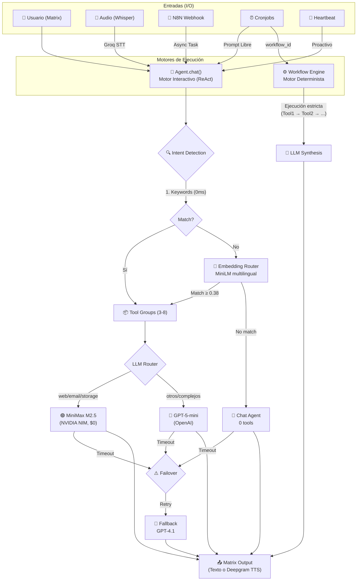

# 🖤 Jada — Personal AI Agent

> Agente de IA personal con un motor de ejecución híbrido: Patrón Coordinator + ReAct para interacción natural en Matrix, y un **Workflow Engine determinista** para tareas programadas. Multi-LLM, telemetría FastAPI y webhook listener integrado.

```
     ██╗ █████╗ ██████╗  █████╗
     ██║██╔══██╗██╔══██╗██╔══██╗
     ██║███████║██║  ██║███████║
██   ██║██╔══██║██║  ██║██╔══██║
╚█████╔╝██║  ██║██████╔╝██║  ██║
 ╚════╝ ╚═╝  ╚═╝╚═════╝ ╚═╝  ╚═╝
       Personal AI Agent — 5panes
```

## ¿Qué es Jada?

Jada es tu asistente personal nativa que vive en Matrix. Tiene humor negro, es directa, sarcástica con cariño, y te resuelve la vida. No simula acciones: las ejecuta. Ya sea leyendo tu correo, guardando tus rutinas del gimnasio o resumiendo tu agenda, Jada prioriza la eficiencia.

## Arquitectura Híbrida

Jada procesa las tareas utilizando dos motores de razonamiento diferentes según la naturaleza de la solicitud para maximizar la confiabilidad y minimizar costos.



### 1. Motor Interactivo (ReAct + Tool Group Routing)
Utilizado para los comandos sueltos, la voz y el chat diario a través de Matrix. Basado en el patrón *Coordinator*, solo provee al LLM las herramientas que necesita según la intención detectada. Todo el flujo es dinámico y guiado por el LLM.

### 2. Motor Determinista (Workflow Engine)
Utilizado para tareas programadas (Cronjobs). Las tareas recurrentes como "El briefing de la mañana" se ejecutan paso a paso en código Python puro sin que el LLM decida qué herramientas llamar (evitando *hallucinations* y timouts). El LLM solo se invoca en el último paso (`synthesis`) para redactar la información extraída a texto humano de forma impecable.

## Stack Tecnológico 2026

| Capa | Tecnología |
|------|-----------:|
| Frontend (Chat) | Matrix (matrix-nio) |
| API Dashboard & Métricas | **FastAPI** (Uvicorn) - Port `8080` |
| Webhook Listener (N8N) | aiohttp - Port `8899` |
| LLM Primary | OpenAI — GPT-5-mini |
| LLM Tools (Gratis) | MiniMax M2.5 (NVIDIA NIM) |
| LLM Fallback | OpenAI — GPT-4.1 |
| STT (Voz entrada) | Groq Whisper — `whisper-large-v3-turbo` |
| TTS (Voz salida) | Deepgram — `aura-2-gloria-es` |
| BBDD (Métricas/Estados) | **SQLite** (`memory.db` local) |
| BBDD (Datos usuario) | MongoDB Atlas |
| Framework Core | **Agno** (`agno.models.openai` + `agno.agent`) |
| Cloud Storage | Supabase Storage (S3 Protocol / boto3) |

## Características Core

### Telemetría y Dashboard API (FastAPI)
Jada corre un servidor interno en el puerto `8080` que expone datos estadísticos en crudo para ser renderizados por un Dashboard (como Next.js en Vercel).
- `/api/v1/metrics/overview`: Conteo general de mensajes y uso de tokens.
- `/api/v1/metrics/daily`: Uso cronológico de la IA para auditar costos de API.
- `/api/v1/metrics/tools`: Listado y frecuencia de las herramientas más ejecutadas.
- `/api/v1/metrics/models`: Comparativa de Latencia y Velocidad de los modelos IA.
- `/api/v1/messages/{session_id}`: Historial robusto de conversaciones de un room.
- `/api/v1/logs`: Streaming eficiente (anti OOM) del log del servidor en crudo.

### Webhook Listener
Integra servicios de terceros (como n8n, Zapier) activando flujos silenciosos mediante peticiones HTTP. 
Ejecutándose en el puerto `8899`, permite inyectar mensajes asíncronos directamente a tu sala privada de Matrix tras autenticarse mediante el header `X-Jada-Webhook-Secret`.

### Voice (I/O)
- **STT (entrada)** — Mensajes de voz transcritos con Groq Whisper, fraccionado (`chunking`) inteligentemente si es muy largo.
- **TTS (salida)** — Deepgram `aura-2-gloria-es` para interactuar por voz (activado cuando le pides explícitamente "háblame" o durante un _Heartbeat_ proactivo).

### Storage & Files
- Integración profunda S3 vía Boto3 apuntando a Supabase Storage. Subes y bajas archivos de la nube directamente al chat con links públicos efímeros o persistentes.

### Gym Room (`#gimnasio`)
- Un Room de Matrix dedicado donde tiras código como `press banca 4x10 80` o `curl 3x12 15` sin comandos de invocación. Ella buferea. Cuando escribes `/guardar`, empaqueta el log completo vía JSON y lo escupe a MongoDB.

## Interfaz de Instalación (Setup)

El archivo `requirements.txt` ha sido reestructurado para instalar *únicamente* dependencias directas de alto nivel, dejando a `pip` y `apt` lidiar con la redundancia.

```bash
# 1. Clonar y preparar venv
git clone https://github.com/judmontoyaso/jada.git
cd jada
python -m venv .venv
source .venv/bin/activate

# 2. Dependencias de Python
pip install -r requirements.txt

# 3. Dependencias del binarias del VPS (Ej: transcodificación FFmpeg)
sudo apt install ffmpeg -y

# 4. Configurar Entorno
cp .env.example .env
# -> Rellena tus tokens: OpenAI, NVIDIA NIM, Matrix, Supabase, Groq.
# -> Asegura tener la variable JADA_WEBHOOK_SECRET configurada.

# 5. Ejecutar la instancia
python main.py              # modo background silencioso
python main.py --livelogs   # modo verboso para debugging
```

En producción bajo un VPS (P. ej. Ubuntu 24.04), se recomienda usar una configuración **systemd** que apunte al entorno virtual `ExecStart=/opt/jada/.venv/bin/python main.py`.

## Estructura de Proyecto

```
jada/
├── .agent/                     # Archivos fuente de personalidad (soul, user, heartbeat config)
├── agent/
│   ├── agent.py                # Coordinador Central (El puente entre la BBDD, Scheduler y Agno)
│   ├── workflows.py            # Workflow Engine determinista (morning_brief, informes pesados)
│   ├── scheduler.py            # Rutas y planificador de Cronjobs
│   └── tools_registry.py       # Registro y catalogación de tools para Agno
├── matrix/
│   └── client.py               # Framework receptor, sender y procesador binario de Matrix
├── tools/                      
│   ├── api_server.py           # FastAPI Web Server (Puertos Dashboard)
│   ├── webhook_server.py       # AIOHTTP Listener (Puertos Ocultos N8N)
│   ├── metrics.py              # SQLite Tracker para la telemetría del consumo del LLM
│   └── *.py                    # Implementaciones de las Tools (email, browser, google calendar, storage)
├── main.py                     # Entrypoint + Uvicorn Async Launcher
└── cronjobs.json               # Persistencia de crons activos y workflows
```

---
*Construida con amor, eficiencia de tokens, y mucho sarcasmo. — 5panes*
