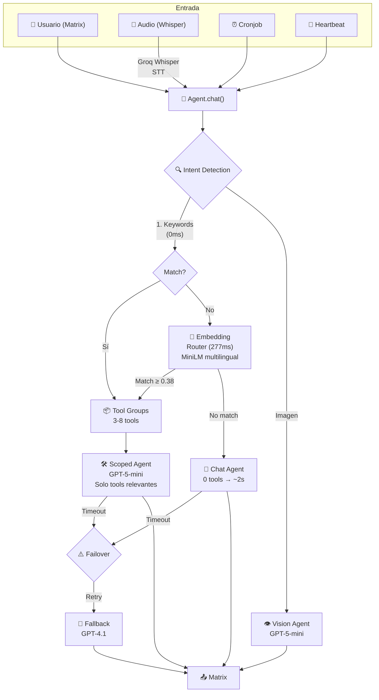

# 🖤 Jada — Personal AI Agent

> Agente de IA personal con patrón Coordinator + ReAct + Tool Group Routing. Matrix como interfaz, OpenAI como cerebro, embeddings como radar.

```
     ██╗ █████╗ ██████╗  █████╗
     ██║██╔══██╗██╔══██╗██╔══██╗
     ██║███████║██║  ██║███████║
██   ██║██╔══██║██║  ██║██╔══██║
╚█████╔╝██║  ██║██████╔╝██║  ██║
 ╚════╝ ╚═╝  ╚═╝╚═════╝ ╚═╝  ╚═╝
       Personal AI Agent — 5panes
```

## ¿Qué es Jada?

Jada es un agente de IA personal que vive en Matrix. Tiene humor negro, es directa, sarcástica con cariño, y útil de verdad. No pone "¿En qué más te puedo ayudar?" al final de cada mensaje. Ejecuta acciones reales, no simula.

## Patrón de Diseño Agéntico

Basado en el [Coordinator Pattern](https://docs.cloud.google.com/architecture/choose-design-pattern-agentic-ai-system?hl=es) de Google Cloud, con **Tool Group Routing** para minimizar tokens y latencia.



### ¿Por qué este patrón?

| Decisión | Razón |
|---|---|
| **Tool Group Routing** | "Guarda nota" → solo 4 tools (notes), no 44. Ahorra ~91% de tokens |
| **Keywords + Embeddings** | Keywords para el 95% rápido; embeddings (MiniLM) para intenciones indirectas |
| **Coordinator (no multi-agent)** | Un solo punto de entrada simplifica debugging y estado |
| **ReAct loop** | El LLM razona → ejecuta tool → observa resultado → responde |
| **Failover automático** | Si GPT-5-mini falla (timeout 45s), GPT-4.1 toma el relevo |
| **Heartbeat proactivo** | Cada 2h decide si habla (chiste, consejo, pregunta) o se calla |

### Tool Groups

11 grupos de herramientas. Solo se inyectan los relevantes por request:

| Grupo | Tools | Ejemplo de activación |
|-------|-------|-----------------------|
| `notes` | 4 | "guarda esta nota", "mis apuntes" |
| `email` | 4 | "correos sin leer", "envía un email" |
| `calendar` | 3 | "agenda reunión", "qué tengo hoy" |
| `gym` | 9 | "registra entrenamiento", "press banca" |
| `tv` | 3 | "prende la tele", "sube volumen" |
| `reminders` | 3 | "recuérdame en 5 min" |
| `cronjobs` | 5 | "programa tarea diaria" |
| `web` | 7 | "busca noticias", "clima", "resume URL" |
| `files` | 4 | "lee archivo", "ejecuta comando" |
| `media` | 1 | "genera una imagen de..." |
| `think` | 1 | "analiza esto en detalle" |

## Características

- **Personalidad** — Definida en `.agent/soul.md`. Humor negro, directa, técnica cuando toca.
- **Voice (STT)** — Mensajes de voz transcritos con Groq Whisper (`whisper-large-v3-turbo`). Soporta chunking para audios largos (reuniones).
- **Embedding Router** — `paraphrase-multilingual-MiniLM-L12-v2` detecta intenciones indirectas en 50+ idiomas.
- **Tool Group Routing** — Solo inyecta los tools relevantes (3-8 vs 44). Ahorra ~90% de tokens.
- **Heartbeat** — Se activa cada 2h. Chistes, consejos, preguntas. Config en `.agent/heartbeat.md`.
- **Cronjobs** — Tareas programadas en lenguaje natural.
- **44 Tools** — Correo, Calendar, gym, TV Samsung, web search, notas, shell, imagen, recordatorios.
- **ReAct loop** — Razona → activa tool → observa resultado → responde. No inventa.
- **Failover LLM** — GPT-5-mini → GPT-4.1 (automático en timeout).
- **Dashboard** — Next.js en `jada_dashboard/`. Logs en vivo, editor de MD, gestor de cronjobs.
- **Nudge inteligente** — Si tarda >20s avisa que sigue viva. A los 90s se rinde con dignidad.

## Stack

| Capa | Tecnología |
|------|-----------|
| Interfaz | Matrix (matrix-nio) |
| LLM Primary | OpenAI — GPT-5-mini |
| LLM Fallback | OpenAI — GPT-4.1 |
| STT (voz) | Groq Whisper — `whisper-large-v3-turbo` |
| Embeddings | `paraphrase-multilingual-MiniLM-L12-v2` (local, CPU) |
| Framework | **Agno** (`agno.models.openai` + `agno.agent`) |
| Memoria | SQLite (historial) + MongoDB Atlas (gym, notas) |
| Scheduler | croniter + asyncio |
| Dashboard | Next.js + TypeScript |
| Runtime | Python 3.12 / systemd / Ubuntu 24.04 |

## Estructura

```
jada/
├── .agent/                     # Configuración del agente
│   ├── soul.md                 # Personalidad de Jada
│   ├── user.md                 # Info del usuario (Juan)
│   └── heartbeat.md            # Config del heartbeat proactivo
├── agent/
│   ├── agent.py                # Coordinator + ReAct + Tool Group Routing
│   ├── tools_registry.py       # 44 tools en 11 grupos (Agno Toolkit)
│   ├── embeddings_router.py    # Router semántico (MiniLM multilingual)
│   ├── heartbeat.py            # Voz proactiva (cada 2h)
│   └── scheduler.py            # Cronjobs con croniter
├── matrix/
│   └── client.py               # Bot Matrix + audio/imagen/texto + nudge
├── tools/                      # Implementaciones de tools
│   ├── transcribe.py           # Groq Whisper STT + chunking
│   ├── notes.py                # CRUD notas (MongoDB)
│   ├── email_reader.py         # IMAP Gmail (lectura)
│   ├── email_sender.py         # SMTP Gmail (envío)
│   ├── calendar_api.py         # Google Calendar ICS
│   ├── gym_db.py               # MongoDB gym log
│   ├── gym_parser.py           # Parser notación gym (3x10x80)
│   ├── samsung_tv.py           # SmartThings API
│   ├── web_search.py           # DuckDuckGo / Google News
│   ├── weather.py              # Clima (wttr.in)
│   ├── image_gen.py            # Stable Diffusion 3 (NVIDIA)
│   ├── reminders.py            # Recordatorios rápidos
│   ├── deep_think.py           # Modelo de razonamiento profundo
│   ├── shell.py                # Comandos de sistema (whitelist)
│   ├── browser.py              # Navegador headless
│   ├── files.py                # Lectura/escritura de archivos
│   └── summarizer.py           # Extractor de texto de URLs
├── tests/                      # Tests
├── main.py                     # Entrada principal
├── cronjobs.json               # Estado de tareas programadas
└── jada_dashboard/             # Dashboard Next.js
```

## Setup rápido

```bash
# 1. Clonar
git clone https://github.com/judmontoyaso/jada.git
cd jada

# 2. Entorno virtual
python -m venv .venv
source .venv/bin/activate

# 3. Dependencias
pip install -r requirements.txt

# 4. Dependencias del sistema (audio)
sudo apt install ffmpeg -y

# 5. Configurar
cp .env.example .env
# Editar .env con tus credenciales (ver abajo)

# 6. Arrancar
python main.py              # modo silencioso
python main.py --livelogs   # con logs en pantalla
```

## Variables de entorno (.env)

```env
# LLM (OpenAI)
OPENAI_API_KEY=sk-proj-...
OPENAI_FUNCTION_MODEL=gpt-5-mini
OPENAI_FALLBACK_MODEL=gpt-4.1

# Groq (Whisper STT)
GROQ_API_KEY=gsk_...
WHISPER_MODEL=whisper-large-v3-turbo

# Matrix
MATRIX_HOMESERVER=https://matrix.tu-servidor.me
MATRIX_USER=@jada:matrix.tu-servidor.me
MATRIX_ACCESS_TOKEN=syt_...

# Correo (IMAP)
IMAP_SERVER=imap.gmail.com
IMAP_USER=tu@gmail.com
IMAP_PASSWORD=xxxx xxxx xxxx xxxx  # App Password

# MongoDB (gym + notas)
MONGO_URI=mongodb+srv://...

# Timeouts
LLM_TIMEOUT=45              # seg por llamada LLM
JADA_THINK_TIMEOUT=90       # seg máx total para responder
JADA_NUDGE_AFTER=20         # seg antes de avisar que sigue viva
```

## Producción (systemd)

```ini
# /etc/systemd/system/jada.service
[Unit]
Description=Jada AI Agent — Personal AI by 5panes
After=network.target

[Service]
User=root
WorkingDirectory=/opt/jada
ExecStart=/opt/jada/.venv/bin/python main.py
Restart=always
RestartSec=10
EnvironmentFile=/opt/jada/.env

[Install]
WantedBy=multi-user.target
```

```bash
systemctl daemon-reload
systemctl enable jada
systemctl start jada
journalctl -u jada -f  # ver logs
```

## Comandos en Matrix

| Comando | Resultado |
|---------|-----------|
| `consulta mis correos` | Lista bandeja de entrada |
| `guarda una nota: ...` | Guarda en MongoDB |
| `revisa el calendario` | Eventos de hoy |
| `recuérdame X en 30 minutos` | Recordatorio rápido |
| `mis tareas programadas` | Lista cronjobs activos |
| `prende la tele` | SmartThings TV |
| `clima en Medellín` | Pronóstico actual |
| `genera una imagen de...` | Stable Diffusion 3 |
| 🎤 *mensaje de voz* | Transcripción + respuesta automática |
| `/clear` | Borra historial del chat |

## Dashboard

```bash
cd jada_dashboard
npm install
npm run dev   # http://localhost:3000
```

---

*Construida con amor, cafeína y mucho stack trace. — 5panes*
